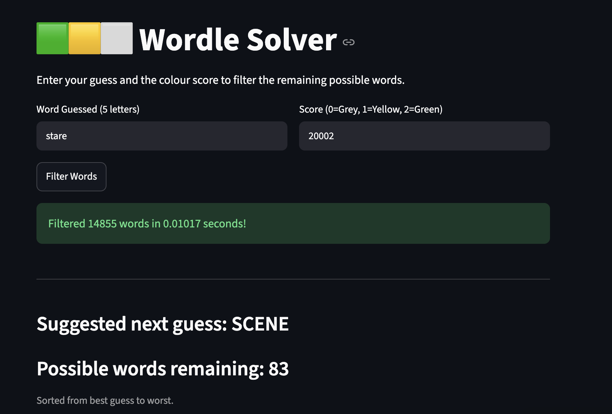

# Wordle Solver

A Python solver that filters and ranks a 14,000+ word guess dictionary to suggest the best next guess in under 20ms.

**[Try the live app](https://wordlesolver-dwcjjbb79ulbj2aa3zacto.streamlit.app/)**



## How to use it
1. Enter the word you guessed in Wordle.
2. Enter the score as five digits: `0` = grey, `1` = yellow, `2` = green (for example `01200`).
3. Click **Filter Words**. The app removes every word that no longer fits and shows the best next guess at the top.
4. Repeat until solved, or click **Reset Game** to start over.

## How it works

**Filtering.** After each guess, the solver tracks the minimum and maximum number of times each letter can appear, plus the positions where a letter is ruled out. This keeps words that fit the feedback and removes the rest, including cases with repeated letters.

**Ranking.** The remaining words are ranked by a letter-frequency score:
- Each letter is scored by how common it is across the words still possible (counted once per word).
- A word's score is the sum of its letter scores.
- Each repeated letter within a word counts for half as much as the previous one, so words that waste guesses on duplicates rank lower.
- Scores are recalculated after every guess, so the ranking adapts as the list shrinks.

**App.** Built with Streamlit, using session state to keep track of the remaining words between turns. The full ranked list is cached so it is only computed once.

## Performance
Filtering and ranking the remaining words takes under 20ms per guess. The app shows the measured time after each guess.

## Run locally
```
pip install -r requirements.txt
streamlit run app.py
```

## Project structure
| File | Purpose |
|---|---|
| `app.py` | Streamlit interface and session state |
| `solver_logic.py` | Word loading, filtering and ranking |
| `wordlewords.txt` | Word list (14,000+ words) |
| `requirements.txt` | Dependencies |

## Built with
Python, Streamlit
